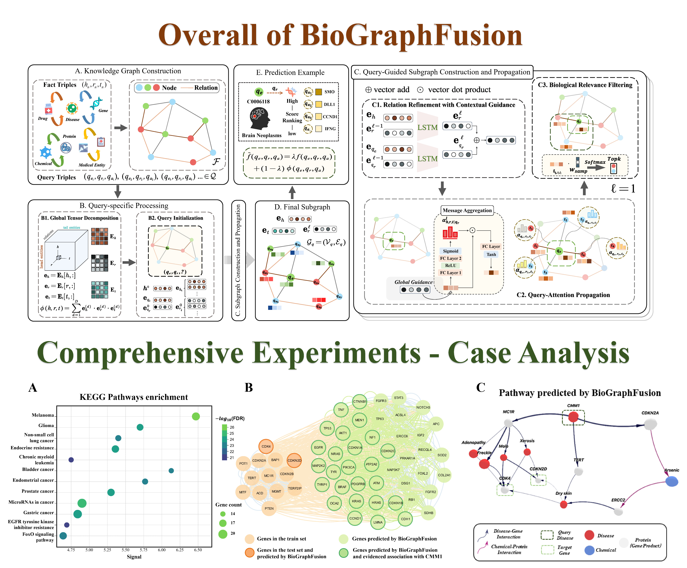
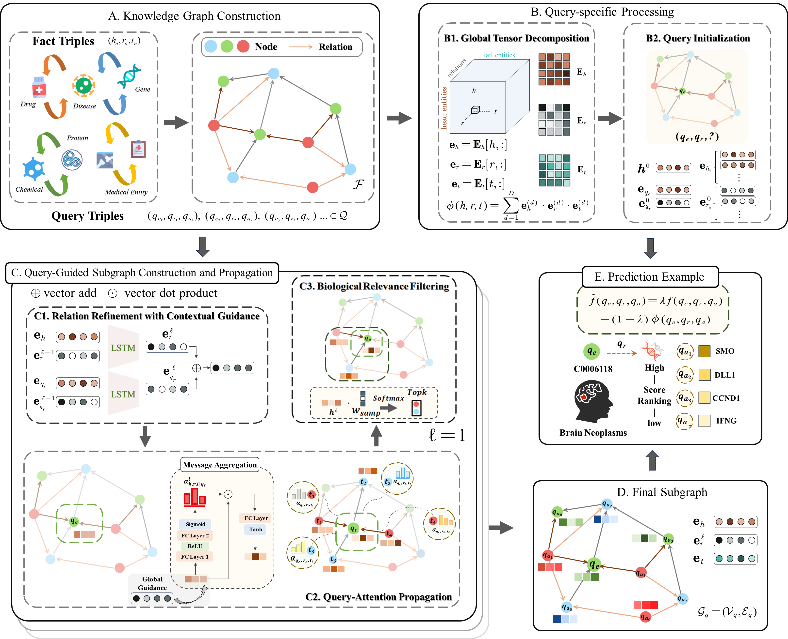
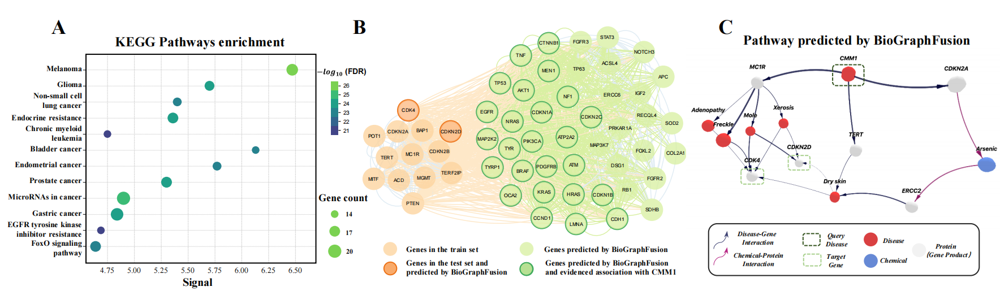
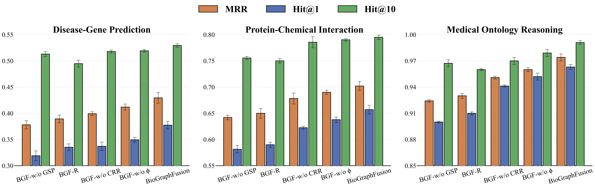
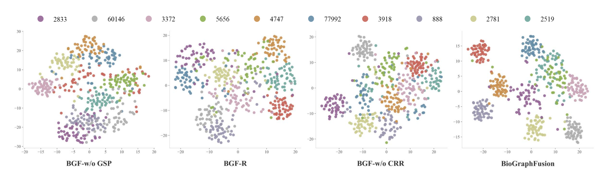
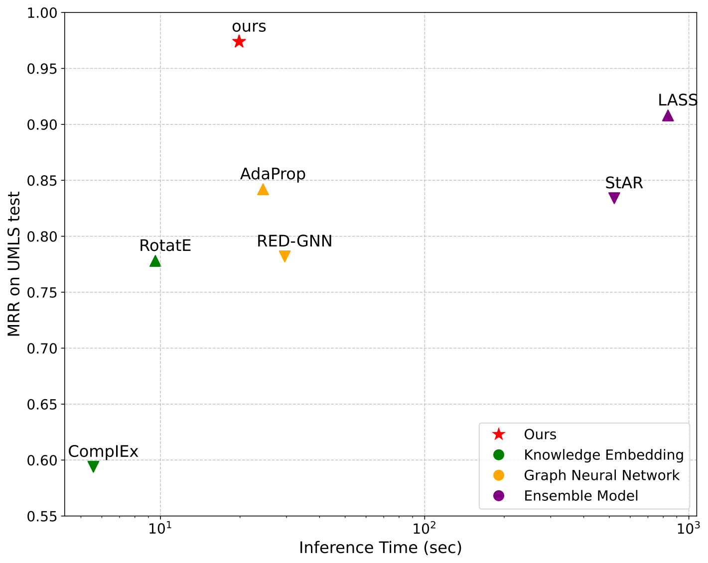

# BioGraphFusion: Graph Knowledge Embedding for Biological Completion and Reasoning

[](https://doi.org/10.5281/zenodo.15869617)
[](https://pytorch.org/)
[](https://github.com/Y-TARL/BioGraphFusion)

> This repository contains the official implementation of the paper **"BioGraphFusion: Graph Knowledge Embedding for Biological Completion and Reasoning"** accepted by *Bioinformatics*.



## 🔥 News
- **2025-03**: 📃 Submission
- **2025-05**: ♻️ Major Revision 
- **2025-07**: 🎉 Acceptance

## 📖 Abstract

**Motivation:** Biomedical knowledge graphs (KGs) are crucial for drug discovery and disease understanding, yet their completion and reasoning are challenging. Knowledge Embedding (KE) methods capture global semantics but struggle with dynamic structural integration, while Graph Neural Networks (GNNs) excel locally but often lack semantic understanding. Even ensemble approaches, including those leveraging language models, often fail to achieve a deep, adaptive, and synergistic co-evolution between semantic comprehension and structural learning. Addressing this critical gap in fostering continuous, reciprocal refinement between these two aspects in complex biomedical KGs is paramount.

**Results:** We introduce BioGraphFusion, a novel framework for deeply synergistic semantic and structural learning. BioGraphFusion establishes a global semantic foundation via tensor decomposition, guiding an LSTM-driven mechanism to dynamically refine relation embeddings during graph propagation. This fosters adaptive interplay between semantic understanding and structural learning, further enhanced by query-guided subgraph construction and a hybrid scoring mechanism. Experiments across three key biomedical tasks demonstrate BioGraphFusion's superior performance over state-of-the-art KE, GNN, and ensemble models. A case study on Cutaneous Malignant Melanoma 1 (CMM1) highlights its ability to unveil biologically meaningful pathways.



## 🏆 Results

Our method achieves state-of-the-art performance across three biomedical tasks:

| **Type** | **Models** | **Disease-Gene Prediction** | | | **Protein-Chemical Interaction** | | | **Medical Ontology Reasoning** | | |
|----------|------------|--------------|---|---|------------------------|---|---|----------------------|---|---|
| | | **MRR** | **Hit@1** | **Hit@10** | **MRR** | **Hit@1** | **Hit@10** | **MRR** | **Hit@1** | **Hit@10** |
| **KE** | RotatE | 0.263 | 0.202 | 0.381 | 0.606 | 0.512 | 0.778 | 0.925 | 0.863 | 0.993 |
| | ComplEx | 0.392 | 0.336 | 0.498 | 0.356 | 0.236 | 0.594 | 0.630 | 0.493 | 0.893 |
| | DistMult | 0.258 | 0.198 | 0.375 | 0.120 | 0.045 | 0.276 | 0.569 | 0.461 | 0.797 |
| | CP-N3 | 0.207 | 0.151 | 0.312 | 0.089 | 0.029 | 0.189 | 0.300 | 0.134 | 0.750 |
| | KDGene | 0.384 | 0.321 | 0.523† | 0.085 | 0.023 | 0.170 | 0.260 | 0.100 | 0.708 |
| **GNN** | pLogicNet | 0.228 | 0.173 | 0.335 | 0.591 | 0.564 | 0.630 | 0.842 | 0.772 | 0.965 |
| | CompGCN | 0.252 | 0.191 | 0.367 | 0.614 | 0.576 | 0.676 | 0.907 | 0.867 | 0.994 |
| | DPMPN | 0.293 | 0.235 | 0.393 | 0.632 | 0.614 | 0.729 | 0.930 | 0.899 | 0.980 |
| | AdaProp | 0.345 | 0.296 | 0.438 | 0.662† | 0.631† | 0.781 | 0.969† | 0.956† | **0.995** |
| | RED-GNN | 0.389† | 0.332† | 0.468 | 0.662† | 0.613 | 0.782† | 0.964 | 0.946 | 0.990 |
| **Ensemble** | KG-BERT | - | - | - | - | - | - | 0.774 | 0.649 | 0.967 |
| | StAR | 0.247 | 0.192 | 0.361 | 0.426 | 0.326 | 0.700 | 0.834 | 0.720 | 0.976 |
| | LASS | 0.211 | 0.167 | 0.324 | 0.401 | 0.314 | 0.691 | 0.908 | 0.952 | 0.983 |
| **Ours** | **BioGraphFusion** | **0.429**\*\* | **0.377**\*\* | **0.529**\* | **0.702**\*\* | **0.657**\* | **0.795**\* | **0.974** | **0.963**\* | 0.991† |

**Note**: The best results are highlighted in **bold** and the second-best results are marked with †. 
\* denotes statistically significant improvements over the best baseline (\*: p-value<0.01; \*\*: p-value<0.001; paired t-test on 5 random seeds).
'-' means unavailable results.

## 🚀 Quick Start

### Dependencies

The following dependencies are required:

- torch == 1.12.1
- torch_scatter == 2.0.9
- numpy == 1.21.6
- scipy == 1.10.1

### Installation and Usage

1. **Clone the repository:**

   ```bash
   git clone https://github.com/Y-TARL/BioGraphFusion.git
   cd BioGraphFusion
   ```

2. **Install all dependencies from `requirement.txt`:**

   ```bash
   pip install -r requirement.txt
   ```

3. **Navigate to the `code` directory:**

   ```bash
   cd code
   ```

4. **Run the training script, for example:**

   ```bash
   python3 train.py --data_path ../data/Disease-Gene/DisGeNet_cv --topk 800 --layers 6 --fact_ratio 0.92 --gpu 0
   ```

### Dataset Preparation

The repository includes three benchmark datasets:

- **Disease-Gene Prediction**: DisGeNet_cv dataset for disease-gene association prediction
- **Protein-Chemical Interaction**: STITCH dataset for protein-chemical interaction prediction  
- **Medical Ontology Reasoning**: UMLS dataset for medical concept reasoning

All datasets are preprocessed and ready to use in the `data/` directory.

---

### Reproduction with Training Scripts

#### Disease-Gene Prediction

```bash
python3 train.py --data_path ../data/Disease-Gene/DisGeNet_cv --topk 800 --layers 6 --fact_ratio 0.92 --gpu 0 
```

#### Protein-Chemical Prediction

```bash
python3 train.py --data_path ../data/Protein-Chemical/STITCH --topk 300 --layers 6 --fact_ratio 0.92 --gpu 0 
```

#### UMLS Dataset

```bash
python3 train.py --data_path ../data/umls/ --topk 100 --layers 5 --fact_ratio 0.90 --gpu 0 
```

## 🔬 Case Analysis: Cutaneous Malignant Melanoma 1 (CMM1)

To demonstrate BioGraphFusion's biological interpretability, we conducted a comprehensive case study on Cutaneous Malignant Melanoma 1 (CMM1):



**Key Findings:**

- **(A) KEGG Pathway Enrichment Analysis**: The bubble chart reveals significantly enriched pathways related to melanoma, validating our model's biological relevance
- **(B) PPI Network Visualization**: Link visualization shows both known and predicted genes for melanoma within the protein-protein interaction network
- **(C) Mechanistic Pathway Discovery**: BioGraphFusion successfully identified biologically plausible mechanistic links between CMM1 and established melanoma-associated genes

This case study highlights BioGraphFusion's capability to unveil meaningful biological pathways and provide interpretable predictions for complex disease mechanisms.

## 🧪 Comprehensive Ablation Study

We conduct extensive ablation studies to validate the effectiveness of each component in BioGraphFusion:



### 💫 Key Components Analyzed

To evaluate individual component contributions in BioGraphFusion, we performed ablation studies on key modules for global semantics, graph structure propagation, and their hybrid scoring. Four targeted variants were implemented:

1. **BGF-w/o GSP**: Removal of Graph Structure Propagation - removes dynamic structural learning to assess GSP's role in our model
2. **BGF-R**: Random Query Encoding - CP-derived query embeddings are replaced with randomly initialized vectors, disrupting semantic alignment  
3. **BGF-w/o CRR**: Removal of Contextual Relation Refinement - omits the LSTM-based updates for relation embeddings
4. **BGF-w/o φ**: Elimination of the Tensor Decomposition Score - excludes the CP-based branch from the hybrid scoring function, leaving only the contextualized structural patterns to drive the scoring mechanism

###  ✨ Ablation Results Analysis

The ablation study results highlight the distinct contributions of structural propagation (GSP) and knowledge embedding (KE) components:

**Key Findings:**

- **Most Critical Component**: Removing the GSP module (BGF-w/o GSP) leads to the most pronounced performance drop across all tasks, underscoring the essential role of dynamic structural learning in capturing topological dependencies and facilitating effective knowledge integration. This demonstrates that structural propagation is indispensable for modeling complex biomedical relationships that rely on multi-hop and context-dependent interactions.

- **KE Components Impact**: The other three ablation variants primarily target KE-related modules, each resulting in significant but distinct performance declines:
  - **BGF-R** confirms the necessity of CP-based semantic initialization for maintaining meaningful entity representations
  - **BGF-w/o CRR** highlights the importance of LSTM-driven contextual refinement for relation embeddings  
  - **BGF-w/o φ** demonstrates that optimal performance requires balancing global semantic signals with graph-derived structural patterns

- **Synergistic Effect**: These findings confirm our model's success stems from the synergy between structural propagation and semantic embedding, not from either component alone.

### 🎈 Semantic Embedding Visualization



To assess KE components' impact on semantic representation, we visualize protein embeddings from the Protein-Chemical Interaction task using t-SNE. We selected 10 chemical compounds (each linked to 50–100 proteins) and compared the full BioGraphFusion model with ablation variants. Each color represents proteins interacting with the same chemical compound, labeled by PubChem CID.

**Visualization Results:**

- **Full BioGraphFusion**: Produces optimally tight and well-separated protein embeddings for each chemical compound, showing strong intra-cluster cohesion and inter-cluster separation

- **BGF-w/o GSP**: Shows the most diffuse clustering with indistinct inter-group boundaries, highlighting GSP's role in refining entity distinctions

- **BGF-R**: Exhibits clustering with significant overlap, confirming that effective GSP depends on high-quality initial semantic representations

- **BGF-w/o CRR**: Shows clearer clustering than previous variants but with less separation than the full model, emphasizing the crucial role of LSTM-driven relation refinement

These results confirm that CP initialization, dynamic GSP, and LSTM relation refinement each make unique contributions to meaningful biomedical entity representations. The visualization demonstrates BioGraphFusion's effectiveness as a unified framework for producing coherent biomedical embeddings.

## ⚡ Computational Efficiency Analysis

To provide a comprehensive assessment of the trade-off between computational efficiency and predictive accuracy, we present a comparative analysis of BioGraphFusion's inference performance relative to representative baseline models on the UMLS dataset.



### Experimental Setup

- **Hardware**: NVIDIA RTX 3090 GPU
- **Software**: PyTorch 1.12.1
- **Methodology**: Inference times averaged over five independent runs under identical conditions
- **Models Evaluated**: Representative models from three categories:
  - **Knowledge Embedding (KE)**: RotatE, ComplEx
  - **Graph Neural Networks (GNNs)**: AdaProp, RED-GNN  
  - **LM-based Ensemble**: LASS, StAR

### Performance-Efficiency Trade-off Analysis

The scatter plot displays Mean Reciprocal Rank (MRR) versus inference time (seconds) for BioGraphFusion and baseline models:

**🎯 Key Results:**

- **BioGraphFusion**: Achieves **MRR of 0.974** with inference time of **~19.84 seconds**
- **Superior to GNNs**: Faster than AdaProp (24.45s, MRR: 0.842) and RED-GNN (29.54s, MRR: 0.782) while achieving higher accuracy
- **Competitive with KE**: Moderate time increase compared to RotatE (9.56s, MRR: 0.778) and ComplEx (5.57s, MRR: 0.594) but with substantial MRR improvement
- **Significantly more efficient than LM-based**: Much faster than LASS (833.89s, MRR: 0.908) and StAR (522.0s, MRR: 0.834) with higher accuracy

### Why BioGraphFusion Achieves Optimal Balance

**🔧 Design Advantages:**

1. **Global Semantic Guidance**: Tensor decomposition provides efficient pathfinding during reasoning
2. **Query-guided Subgraph Construction**: Selective building of focused, semantically relevant subgraphs
3. **Adaptive Semantic-Structural Integration**: Avoids computational overhead of exploratory subgraph generation
4. **Optimized Architecture**: Balances expressiveness with computational efficiency

**📊 Comparison Insights:**

- **vs. Simple KE**: Higher accuracy with reasonable time increase
- **vs. GNNs**: Better accuracy-efficiency trade-off through semantic guidance
- **vs. LM-based**: Dramatically faster inference while maintaining superior performance

This analysis demonstrates that BioGraphFusion achieves state-of-the-art predictive accuracy without incurring prohibitive computational overheads, making it practical for real-world biomedical applications.

## 📚 Citation

If you find this work useful for your research, please cite our paper:

```bibtex
@article{lin2025biographfusion,
  title={BioGraphFusion: Graph Knowledge Embedding for Biological Completion and Reasoning},
  author={Lin, Yitong and He, Jiaying and Chen, Jiahe and Zhu, Xinnan and Zheng, Jianwei and Bo, Tao},
  journal={Bioinformatics},
  year={2025},
  publisher={Oxford University Press}
}
```

## 🌟 Acknowledgements

- This code is based on the work of [AdaProp](https://github.com/LARS-research/AdaProp). Thanks to the authors for their contributions.
- We thank the reviewers for their valuable feedback and suggestions.
- Special thanks to the biomedical community for providing high-quality datasets.

## 📬 Contact

For questions and collaborations, please contact:
- Project Issues: [GitHub Issues](https://github.com/Y-TARL/BioGraphFusion/issues)