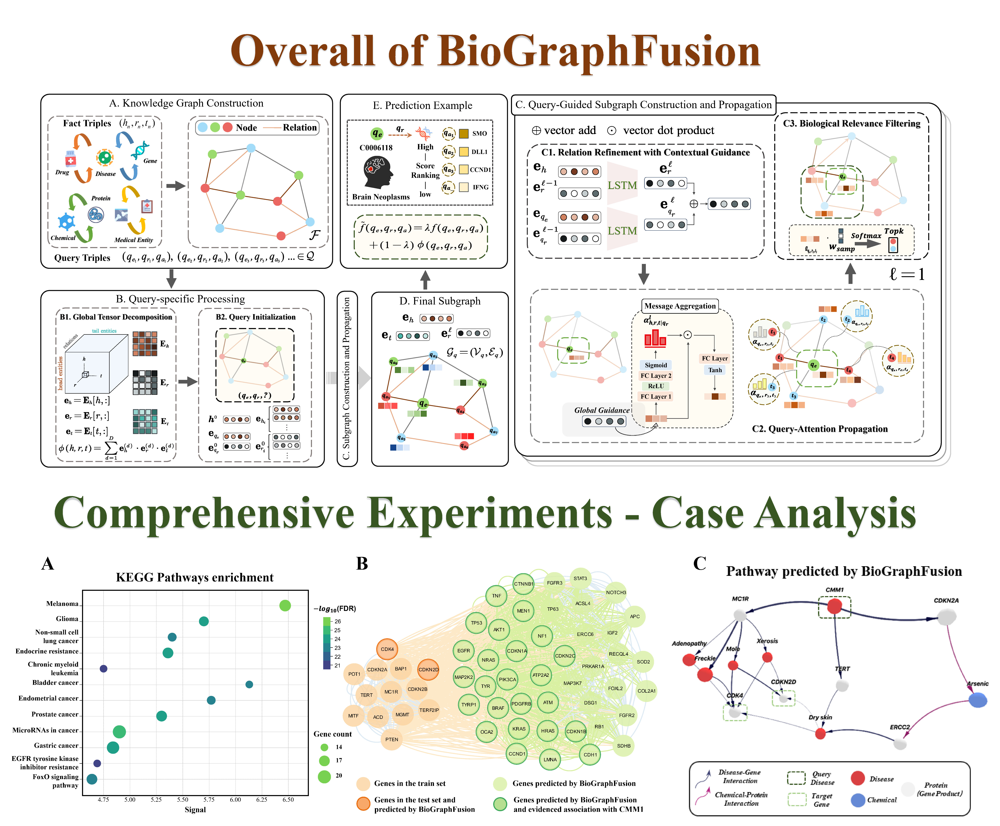

# BioGraphFusion: Graph Knowledge Embedding for Biological Completion and Reasoning

This repository contains the official implementation of the paper **"BioGraphFusion: Graph Knowledge Embedding for Biological Completion and Reasoning"** submitted in *Bioinformatics*.



## Abstract

**Motivation:** Biomedical knowledge graphs (KGs) are crucial for drug discovery and disease understanding, yet their completion and reasoning are challenging. Knowledge Embedding (KE) methods capture global semantics but struggle with dynamic structural integration, while Graph Neural Networks (GNNs) excel locally but often lack semantic understanding. Even ensemble approaches, including those leveraging language models, often fail to achieve a deep, adaptive, and synergistic co-evolution between semantic comprehension and structural learning. Addressing this critical gap in fostering continuous, reciprocal refinement between these two aspects in complex biomedical KGs is paramount.

**Results:** We introduce BioGraphFusion, a novel framework for deeply synergistic semantic and structural learning. BioGraphFusion establishes a global semantic foundation via tensor decomposition, guiding an LSTM-driven mechanism to dynamically refine relation embeddings during graph propagation. This fosters adaptive interplay between semantic understanding and structural learning, further enhanced by query-guided subgraph construction and a hybrid scoring mechanism. Experiments across three key biomedical tasks demonstrate BioGraphFusion's superior performance over state-of-the-art KE, GNN, and ensemble models. A case study on Cutaneous Malignant Melanoma 1 (CMM1) highlights its ability to unveil biologically meaningful pathways.

## Introduction

Knowledge Graphs (KGs) are semantic networks that represent relationships between entities as triples (h, r, t), where h and t denote head and tail entities, and r represents the relation connecting them. Biological knowledge graphs extend this framework to encompass entities such as diseases, genes, drugs, chemicals, and proteins, facilitating structured understanding of clinical knowledge.

Large-scale biological KGs such as DisGeNET, STITCH, and SIDER are widely used in biomedical research, supporting applications including disease gene prediction, drug-target interaction, and drug-drug correlation analysis.

Many such tasks demand practical techniques of Knowledge Graph Completion (KGC) and Knowledge Graph Reasoning (KGR). Both techniques involve predicting the answer to queries of the form (h, r, ?) to identify missing tail entities. While both may be considered as link prediction, they differ: KGC primarily predicts missing direct links by identifying patterns in existing graph data, while KGR is a broader task that infers complex or multi-step knowledge through deeper inferential processes.

BioGraphFusion addresses the fundamental challenge of achieving deep, adaptive coupling between semantic understanding and structural learning in biomedical KGs through:

- **Global Biological Tensor Encoding**: Employs Canonical Polyadic (CP) decomposition to establish foundational global semantic context
- **LSTM-driven Dynamic Refinement**: Dynamically refines relation embeddings during multilayer propagation to capture long-range dependencies
- **Query-guided Subgraph Construction**: Focuses structural exploration on biologically pertinent regions
- **Hybrid Scoring Mechanism**: Integrates global semantic context with local structural reasoning


## Dependencies

- torch == 1.12.1
- torch_scatter == 2.0.9
- numpy == 1.21.6
- scipy == 1.10.1

### Installation and Usage

1. Install all dependencies from `requirement.txt`:

   ```bash
   pip install -r requirement.txt
   ```

2. Navigate to the `code` directory:

   ```bash
   cd code
   ```

3. Run the training script, for example:

   ```bash
   python3 train.py --data_path ../data/Disease-Gene/DisGeNet_cv --topk 800 --layers 6 --fact_ratio 0.92 --gpu 0
   ```

---

### Reproduction with training scripts

##### Disease-Gene Prediction

```bash
python3 train.py --data_path ../data/Disease-Gene/DisGeNet_cv --topk 800 --layers 6 --fact_ratio 0.92 --gpu 0 
```

##### Protein-Chemical Prediction

```bash
python3 train.py --data_path ../data/Protein-Chemical/STITCH --topk 300 --layers 6 --fact_ratio 0.92 --gpu 0 
```

##### UMLS dataset

```bash
python3 train.py --data_path ../data/umls/ --topk 100 --layers 5 --fact_ratio 0.90 --gpu 0 
```

<!-- ## Citation

If you use this code or data in your research, please cite our paper:

```bibtex
@article{lin2025biographfusion,
  title={BioGraphFusion: Graph Knowledge Embedding for Biological Completion and Reasoning},
  author={Lin, Yitong and He, Jiaying and Chen, Jiahe and Zhu, Xinnan and Zheng, Jianwei and Bo, Tao},
  journal={Bioinformatics},
  year={2025}
}
``` -->


## Acknowledgements

This code is based on the work of [AdaProp](https://github.com/LARS-research/AdaProp)

